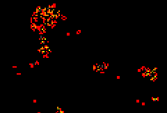

# java-life

Flexible cellular automata system inspired by Conway's Game of Life

Comes with a simple GUI, but there's a lot more power in the underlying system for programmable use.

### Key features

 - Extremely fast engine using rule lookup tables
 - Arbitrary rulesets can be developed with up to 256 cell types
 - TODO: save / load rulesets
 